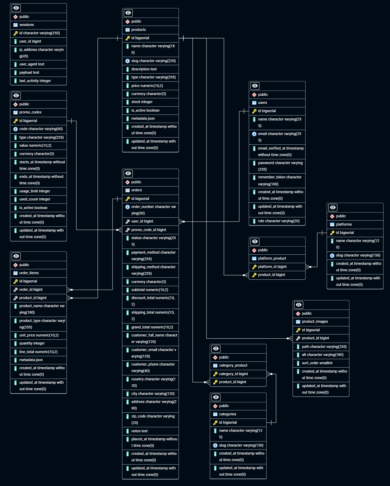
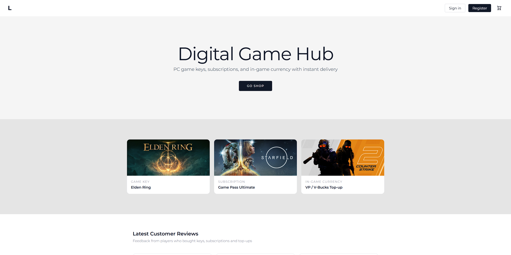
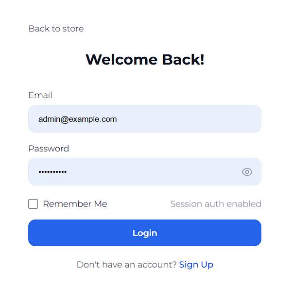
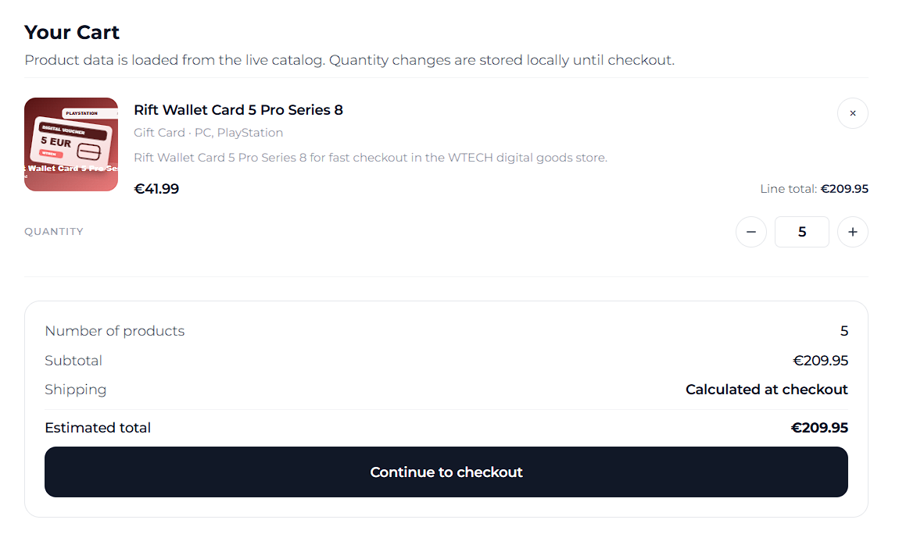
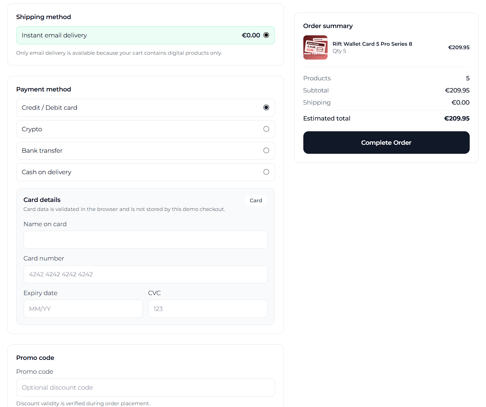
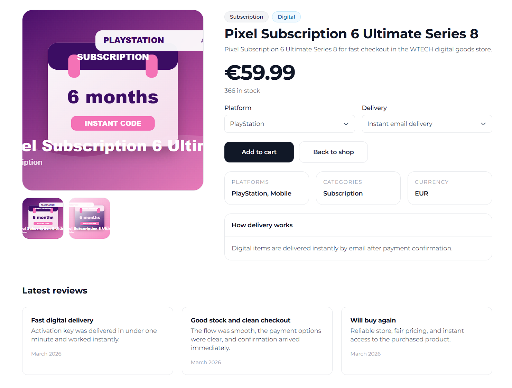

# Dokumentacia projektu - WTECH eshop

## Zadanie

Cielom projektu je webova aplikacia eshopu implementovana v PHP frameworku Laravel. Aplikacia obsahuje klientsku cast pre prehliadanie katalogu, kosik a vytvorenie objednavky bez povinneho prihlasenia, a administratorsku cast pre spravu produktov.

## Programove prostredie

- Backend: Laravel PHP framework
- Databaza: PostgreSQL
- Frontend: Laravel Blade sablony, Tailwind CSS CDN, vanilla JavaScript
- Autentifikacia: Laravel session authentication
- Ukladanie obrazkov: Laravel public storage disk
- Spustenie: `cd backend`, `composer install`, `php artisan migrate --seed`, `php artisan storage:link`, `php artisan serve`

## Fyzicky datovy model

Fyzicky datovy model je odvodený z Laravel migracii. Zdroj diagramu je v `docs/physical_data_model.svg`; pred odovzdanim ho treba exportovat aj ako PNG/JPG, ak AIS vyzaduje striktne obrazkovy format. Hlavne tabulky:

- `users` - zakaznici a administratori, rozliseni atributom `role`
- `user_carts` - serverova prenositelna kosikova data prihlaseneho pouzivatela
- `products` - katalog produktov
- `product_images` - fotografie produktov, minimalne dve fotografie na produkt pri administracnom vytvoreni
- `categories`, `platforms` - ciselniky pre filtrovanie a administracne zaradenie produktov
- `category_product`, `platform_product` - M:N vazby produktov na ciselniky
- `orders` - objednavky vratane dodacich udajov, dopravy, platby a sum
- `order_items` - polozky objednavky
- `promo_codes` - zlavove kody
- Laravel systemove tabulky: `sessions`, `cache`, `jobs`, `password_reset_tokens`

Zmena oproti povodnemu modelu: bola doplnena tabulka `user_carts`, pretoze poziadavka vyzaduje prenositelnost kosika pre prihlaseneho pouzivatela. LocalStorage ostava pre neprihlaseneho pouzivatela, ale po prihlaseni sa lokalny kosik zluci so serverovou verziou.

## Navrhove rozhodnutia

Role pouzivatelov su riesene jednoducho cez stlpec `users.role` s hodnotami `CUSTOMER` a `ADMIN`. Administratorske API a admin Blade stranky su chranene Laravel middleware `auth` a vlastnym middleware `admin`.

Opravnenia neboli modelovane ako samostatna permission tabulka, pretoze projekt rozlisuje iba dve roly a poziadavky nevyzaduju detailne ACL.

Klientske a administratorske stranky su implementovane ako Blade sablony v `backend/resources/views/storefront` a servovane cez Laravel `FrontendController`. Dynamicke data sa nacitavaju cez Laravel JSON API. Tento pristup ponechava sablony citatelne a zaroven splna pouzitie Laravel backendu pre aplikacnu logiku, validaciu, databazu a autentifikaciu.

Kosik neprihlaseneho pouzivatela je ulozeny v `localStorage`, aby bol nakup mozny bez registracie. Po prihlaseni sa vola `/api/cart/merge`, cim sa lokalny kosik prenesie do serverovej tabulky `user_carts`. Pri dalsich zmenach sa kosik synchronizuje cez `/api/cart`.

Platba kartou ma klientsku validaciu cisla karty cez Luhn algoritmus, expiracie a CVC. Surove kartove udaje sa neposielaju a neukladaju do databazy.

## Implementacia vybranych pripadov pouzitia

### Zoznam produktov, filtrovanie, vyhladavanie a strankovanie

Stranka `backend/resources/views/storefront/shop.blade.php` vola `/api/products`. Backend `CatalogProductController@index` podporuje:

- plnotextove hladanie cez parameter `q`
- filtrovanie podla ceny `min_price`, `max_price`
- filtrovanie podla typu produktu `type`
- filtrovanie podla kategorii `categories[]`
- filtrovanie podla platforiem `platforms[]`
- zoradenie `price_asc`, `price_desc`, `oldest`, default `newest`
- strankovanie cez Laravel paginator

### Detail produktu

Stranka `backend/resources/views/storefront/product_details.blade.php` nacita detail cez `/api/products/{slug}`. Detail obsahuje nazov, opis, cenu, sklad, kategorie, platformy a galeriu obrazkov.

### Pridanie produktu do kosika a zmena mnozstva

Pridanie produktu sa vykona na detaile produktu alebo v katalogu. Kosik pouziva `frontend/store_data.js`, kde su funkcie `addItem`, `setItemQty`, `changeItemQty` a `removeItem`. Na stranke `backend/resources/views/storefront/cart.blade.php` moze pouzivatel menit mnozstvo alebo odstranit produkt.

### Nakupny kosik, doprava, platba a objednavka

Checkout je v `backend/resources/views/storefront/cart_order.blade.php`. Doprava a platba sa nacitavaju z `/api/checkout/options`. Objednavka sa odosiela na `/api/orders`, kde `StoreOrderRequest` validuje polozky, platbu, dopravu a dodacie udaje. `OrderController@store` prepocita ceny na serveri, overi sklad a vytvori `orders` a `order_items`.

### Registracia, prihlasenie a odhlasenie

Registracia a prihlasenie pouzivaju `/api/auth/register` a `/api/auth/login`. Odhlasenie vola `/api/auth/logout`. Po prihlaseni admina vracia backend presmerovanie na `/admin_manage.html`, zakaznik ide na `/index.html`.

### Administratorska cast

Admin stranky:

- `backend/resources/views/storefront/admin_manage.blade.php` - zoznam produktov, vyhladavanie, strankovanie, edit/delete
- `backend/resources/views/storefront/admin_new.blade.php` - vytvorenie produktu, povinne minimalne 2 obrazky, vyber kategorii a platforiem
- `backend/resources/views/storefront/admin_edit.blade.php` - uprava produktu, nahravanie novych obrazkov, zoznam existujucich obrazkov a ich odobratie

Admin API fyzicky maze obrazky zo storage pri zmazani produktu alebo obrazku.

## Snímky obrazoviek

